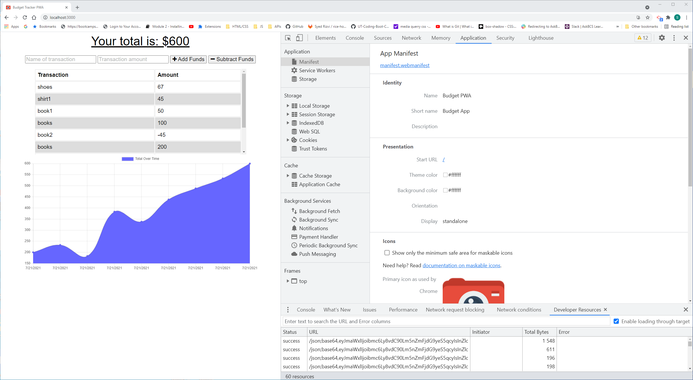
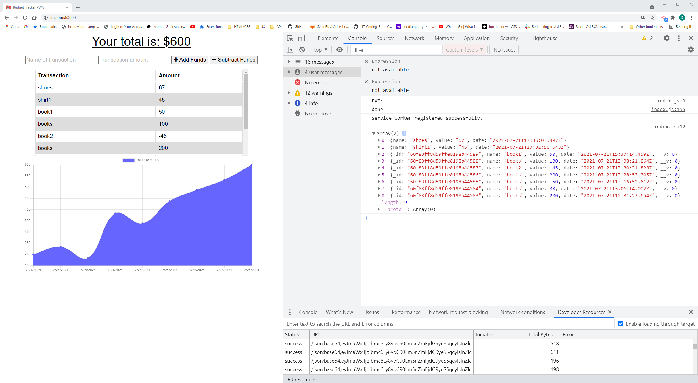
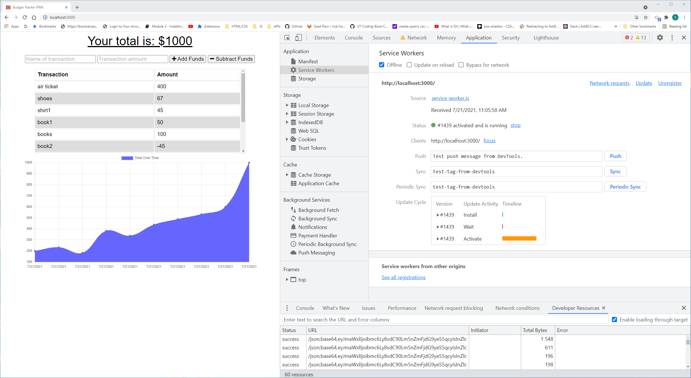

# budget
1. setting up the starting files.
2. Added required code for the manifest
3. Added required code for service-workers
4. Added indexedDB.js file
5. See screen shots of manifest, service workers, localhost and off-line (service workers)
7. Manifest and service-wokers functionality is present in the webpage.
8.  Web-browser also shows addtion of various items and the total budget.
9.  However, an error in the fetch route is preventing Heroku deployed page to show all the changes

Manifest Screen-shot

Service-Workers Screen Shot

Off-line Screen Shot

localhost

Heroku Deployed Page URL
https://cryptic-refuge-55596.herokuapp.com/

